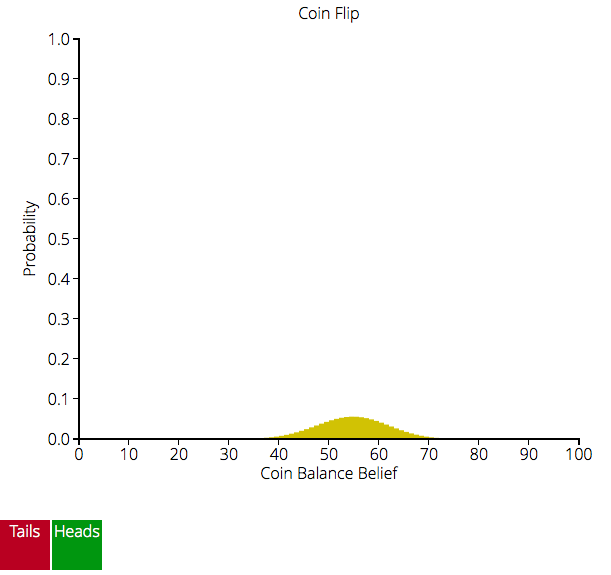

# ThinkBayes and Interactivity

My case study was inspired by an idea from Oscar: to add some interactivity to Allen's ThinkBayes library, with the long-term goal of making computational statistics more accessible to people without coding backgrounds.

Creating a "user interface" of sorts for a library like ThinkBayes isn't the most straightforward proposition, so I wanted to explore some different ways that this could take shape. To that end, I created three interactive examples designed to test my program architecture. These were the Euro (coin flip), rolling multiple dice, and the multi-armed bandit.

## Technical Overview
Before I get into the examples, I'll give a brief rundown of the tools I used to build this interactive interface. I knew that given my experience, I'd have an easier time building an interactive frontend with JavaScript (specifically [d3.js](www.d3js.org)), so a web server/client model made the most sense. For the backend, I used [Flask](http://flask.pocoo.org), even though I had never worked with it before, because it's simple, lightweight, and written in Python. The last point meant that I could run jobs with the ThinkBayes library natively as requests came in! 

One variable the web server/client model introduced was where the state would be held. Since the frontend would already be displaying all the data, I saw no reason to keep another copy on the backend. With that in mind, I developed this data transfer model: all state is held on the frontend. Data structures (like PMFs) are packaged and sent from the frontend to the backend, where they are processed by ThinkBayes and returned to the frontend for storage and display.

In one sense, this turns the webserver into one big wrapper around ThinkBayes. In the interest of sacrificing generality to actually get things done, I didn't quite treat it this way. But this model still made it easy to incrementally add functionality to the webserver that exposed ThinkBayes methods to the frontend.

### Why bother with a webserver at all?

While data transfer between the front and backends did add a fair amount of complexity, it allowed me to use the ThinkBayes library _as-is_, without having to rewrite any of it. While there are numerical libraries for JavaScript, none of them are as extensive as [NumPy](www.numpy.org).I wanted to spend my time with the case study making something new instead of rewriting a library, with the constant worry that I'd change its behavior and report incorrect results.

Here's an example (dice) to explain the data transfer model and to show how Flask made this all very simple.

```python
	@app.route("/api/suite/dice", methods=["GET", "POST"])
	def dice():
		if request.method == "GET":
			pmf = tb.MakePmfFromList([4, 6, 8, 12, 20])

			return packagedpmf(pmf)
		else:
			pmf, update = unpacksuiteupdate(request.get_json())
			update = int(update)

			dice = Dice(pmf)
			dice.Update(update)

			return packagedpmf(dice)
```

When the server receives a `GET` request to `/api/suite/dice`, it generates a PMF of all the different die, and returns them to the client. To update a PMF, the client sends a `POST` request to the same URL. The server unpacks the request, which contains the PMF to be updated and the update data. The server creates a `Dice` suite from the PMF, updates it with the provided data, and returns the updated PMF to the frontend.

The `packagedpmf` function packs the PMF into a JSON string in a standard way, to make the data transfer simple and repeatable. I like to write expressive code that doesn't require comments, and I think this code speaks for itself.

## The examples

### A Weighted(?) Coin

The euro example updates the belief of the probability of flipping heads with a coin given the results of past flips. This is represented by a PMF of the probability of different coin balances, from all tails to all heads.



The interface allows the user to click buttons to report that a flip resulted in either heads or tails. The PMF representing our belief about the coin updates in response.

### Which Dice am I Rolling?

The dice example allows us to determine how many sides the dice we are rolling has based on the results. A PMF keeps track of the probability that each of the possible dice is the one producing the results.


The interface presents the user with buttons corresponding to all the possible results of rolling any of the dice. The PMF updates based on the buttons the user presses.

### The Multi-Armed Bandit

A gambler in front of a row of slot machines faces the one-armed bandit problem. Each machine has a different chance of paying out, and the gambler wants to maximize his total rewards.

One simple algorithm instructs the gambler to always choose the bandit that he believes to be the "best." The "best" bandit is the bandit with the greatest mean probability of success, based on past data. All slot machines start with a uniform prior.

The interface here allows us to watch this algorithm play out in real time. The computer pulls about 20 levers per second, always pulling the lever of the bandit it believes to be the "best."


It's instructive to see the computer try one bandit after another, their PMFs updating in real time, until it comes to the one that pays out the most often. This algorithm does have a tendency to find "local maxima" (i.e. if it hits the 70% bandit early, it will likely never hit the 90% bandit), but it will always give reasonably good results.

## Future Work and Potential

It doesn't take much code to expose a ThinkBayes method to the JavaScript frontend. I've also built a reasonably general bar graph function with d3 that makes it easy to create configured plots that can be updated.

The biggest area of opportunity here is to come up with new methods of interaction with the ThinkBayes library. Exposing the library to the web frontend opens up a myriad of possibilities, and I've only scratched the surface with a few examples that are largely instructive.

The biggest challenge would be to come up with methods of interaction that are open and powerful enough to allow the user to do real work without simply requiring them to write code. This is a pretty open problem in general, but I hope that between the simple data transfer model and the plotting function, I've made a good start.